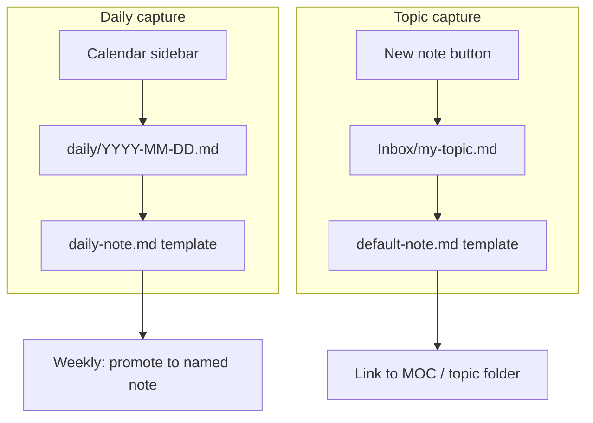

# Daily Workflow

How to capture, link, and maintain notes in this vault.

## Capture

Two paths — pick based on *when* vs *what*:

| | Daily notes | Topic notes (inbox) |
|--|-------------|---------------------|
| **Use when** | Today's log, todos, meeting scratch, links found today | Reference, hunt notes, how-tos — anything you'll search later |
| **Trigger** | Calendar sidebar or `Ctrl+Shift+D` | `Ctrl+N` (New note) or file explorer |
| **Folder** | `daily/YYYY-MM-DD.md` | `Inbox/slug.md` |
| **Filename** | Date is the name (`2026-07-08.md`) | Semantic slug — **no date prefix** |
| **Template** | `daily-note.md` (Calendar) | `default-note.md` (Templater auto) |

**Rule of thumb:** Daily = *when* (today's inbox). Topic = *what* (durable knowledge).



### Hotkeys (assign once in Settings → Hotkeys)

Vault defaults in [`.obsidian/hotkeys.json`](.obsidian/hotkeys.json). Reload Obsidian if a shortcut does nothing.

| Shortcut | Command | Result |
|----------|---------|--------|
| `Ctrl+N` | Create new note | `Inbox/slug.md` + frontmatter (filename = displayed title) |
| `Ctrl+Shift+D` | Daily notes: Open today's daily note | Opens/creates `daily/YYYY-MM-DD.md` |
| `Ctrl+Shift+C` | Calendar: Open view | Opens **Calendar sidebar** (pick dates visually) |
| Calendar click | (visual) | Same as daily shortcut for that date |

**Note:** `Ctrl+Shift+D` opens today's **daily note file**, not the Calendar panel. Use `Ctrl+Shift+C` or the calendar icon in the left ribbon for the sidebar.

Topic notes do not need a `# heading` in the body — Obsidian shows the **filename** as the title in the tab and inline title bar.

`created` is auto-filled by templates. Manual entry only if the template did not run (see **Manual fallback** below).

### Weekly promote (from daily → topic)

1. Scan last 7 files in `daily/`
2. For anything worth keeping, create or move a named note in the right topic folder
3. Link back: `Created from [[2026-07-08]]` in the topic note, or add a bullet in the daily note pointing to `[[malcolm-query-and]]`

### Manual fallback

If a new file has no frontmatter, or you see literal `<% ... %>` text (template not executed):

1. **Reload Templater:** Settings → Community plugins → Templater → toggle **Off**, then **On** (or restart Obsidian). Confirm **Trigger Templater on new file creation** is enabled under Templater settings.
2. **Fix the open note:** Command palette → **Templater: Replace templates in the active file** (not "Templates: Insert template" — that copies raw syntax).
3. **New empty file:** Command palette → **Templater: Insert template** → pick `default-note`.

If auto-trigger still fails after reload, use step 3 when creating inbox notes until Templater is confirmed working.

### For AI vault organizers

- **Inbox** (`Inbox/`) — temporary captures; triage to topic folders `01–09` during review
- **Daily** (`daily/`) — only place with date filenames (`YYYY-MM-DD.md`); `type: daily` in frontmatter
- **Topic notes** — slug filenames; `created: YYYY-MM-DD` in frontmatter is the date source of truth
- Do not add date prefixes to topic filenames (see [[Tag Taxonomy]])

## Link

1. Before finishing a note, add **1–2 wikilinks** to related notes
2. If the note is important, add it to the relevant MOC
3. AI workflow notes should link to [[CLAUDE]] (agent instruction template)

## Commit

1. **Obsidian Git** auto-commits every 30 minutes (configurable in Settings → Obsidian Git)
2. Or commit manually: `git add . && git commit -m "2026-07-07"` then `git push`
3. **Git is source of truth** — pull before editing on another machine

## Review (Weekly)

1. Open **Graph view** — find orphan notes with no connections
2. Move inbox notes from [[Inbox]] into the right topic folder
3. Connect orphans to a MOC or archive to [[09-Personal]]
4. Merge duplicates (see list below)
5. Regenerate the vault map: `python scripts/build-vault-canvas.py --all`

## Regenerate vault map

```bash
python scripts/build-vault-canvas.py --all
```

Run after bulk renames, new MOC links, or tag taxonomy changes. Updates:

- `scripts/vault-graph.json` — scan metrics
- `00-Meta/Vault Map.canvas` — Obsidian MOC map
- Cursor `vault-map.canvas.tsx` — dashboard beside chat in Cursor

## Folder Guide

| Folder | Use for |
|--------|---------|
| `00-Meta/` | Home, MOCs, templates, guidelines |
| `01-NSM-Malcolm/` | Zeek, Suricata, Arkime, OpenSearch, Malcolm |
| `02-Threat-Hunting-DFIR/` | MITRE, forensics, CTF, hunt notes |
| `03-AI-Agents/` | Claude, Cursor, agents, RAG |
| `04-Dev-Environment/` | Git, Python, VS Code, testing |
| `05-Software-Engineering/` | Architecture, agile, MVP |
| `06-Design-Creative/` | UI/UX, p5.js, visual tools |
| `07-Productivity-Work/` | Slack, meetings, work tools |
| `08-Career-Presentations/` | Talks, transcripts, career |
| `09-Personal/` | Personal notes (optional separate vault later) |
| `Inbox/` | Unsorted topic captures (triage weekly) |
| `daily/` | Daily journal (`YYYY-MM-DD.md` via Calendar) |

## Naming Convention

| Pattern | Example | Use |
|---------|---------|-----|
| `slug.md` | `malcolm-orchestration.md` | Topic notes — date lives in frontmatter |
| `YYYY-MM-DD.md` | `2026-07-07.md` | Daily notes only (Calendar) |
| No date prefix | `Home.md`, `MOC - Malcolm & NSM.md` | Hub pages |

## Editing templates

Template **files** live in `00-Meta/templates/` (visible in the file explorer). Changes apply to **new notes only** — existing notes are not updated.

| File | Trigger | Syntax | Config |
|------|---------|--------|--------|
| `default-note.md` | `Ctrl+N` → `Inbox/` | Templater `<%* ... %>` | Templater plugin (see below) |
| `daily-note.md` | `Ctrl+Shift+D` / Calendar | Core `{{date:YYYY-MM-DD}}` | Settings → **Daily notes** (or `.obsidian/daily-notes.json`) |

### Edit inbox defaults (`default-note.md`)

Open the file and change the frontmatter inside the `` tR = `...` `` block — e.g. default `tags`, `lang`, or add starter sections. Keep the `<%* ... %>` wrapper for dynamic dates.

Test: save → `Ctrl+N` → new test note → check Properties.

### Edit daily defaults (`daily-note.md`)

Edit markdown directly. Use `{{date:YYYY-MM-DD}}` for dates, not Templater syntax.

Test: save → `Ctrl+Shift+D` → check today's daily note.

### Folder templates — not a vault folder

**`folder_templates` is not a folder in your vault.** It is a **Templater plugin setting** that means: *"when a new empty file is created in vault folder X, apply template Y automatically."*

Current mapping: **`Inbox/`** → **`default-note.md`**

**In Obsidian UI (easiest):**

1. Settings → **Community plugins** → **Templater** → gear icon
2. Scroll to **Folder Templates**
3. You should see: folder `Inbox` → template `00-Meta/templates/default-note.md`
4. Add or change rows here (e.g. map `09-Personal/` to a Chinese-default template later)

**In Git / Cursor (same data, hidden from normal browsing):**

- File: `.obsidian/plugins/templater-obsidian/data.json`
- Key: `"folder_templates"` — array of `{ "folder": "...", "template": "..." }` objects

The `.obsidian/` folder is Obsidian's config area. It does not appear as a normal note folder unless you open it in Cursor or enable "Show hidden files."

### Manual template (no auto-trigger)

Create any file in `00-Meta/templates/`, then:

- Command palette → **Templater: Insert template** (into current note), or
- **Templater: Create new note from template** (pick template + name)

No `folder_templates` entry needed unless you want it automatic for a folder.

## Known Duplicates to Clean Up

- [[tracking]] + [[tracking-ori]]
- [[python-venv]] + [[python-venv-v2]]
- [[ai-workflow]] + [[ai-workflow-v2]]
- [[vscode-tips]] + [[vscode-tips-v2]]
- [[harness]] + [[harness-v2]]

## Plugins

| Plugin | Status | Purpose |
|--------|--------|---------|
| Obsidian Git | Enabled | Auto-commit to Git |
| Calendar | Enabled | Daily notes in `daily/` |
| Templater | Enabled | Auto-template for `Inbox/` new notes |
| Tag Wrangler | Enabled | Rename/merge tags |
| Advanced Canvas | Enabled | Attack-surface / concept maps |
| Dataview | Optional | Query by `created` frontmatter |
| IOC Lens / SOC Toolkit | When actively hunting | Threat intel enrichment |

## Obsidian Sync vs Git

- **Git** = canonical backup and version history for this repo
- **Obsidian Sync** = optional for mobile/second machine
- Avoid editing the same note on two machines without pulling first

See also: [[obsidian]] for Sync vs Git decision guide.
