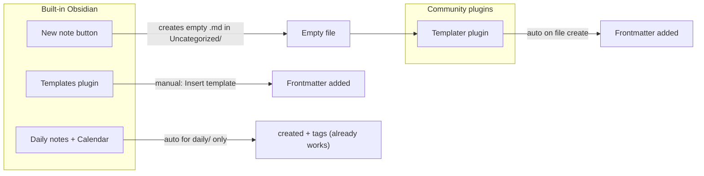

> Related: [[Daily Workflow]] · [[obsidian-new-note-template]] · [[obsidian-setting]]

# Auto-populate `created` date on new Obsidian notes

## How Obsidian handles this (the mechanics)

Obsidian does **not** natively stamp a `created` property when you click **New note**. Out of the box, you get an empty markdown file. Properties (YAML frontmatter) only appear if you add them yourself or apply a template.

Your vault already has three related pieces:



| Mechanism | When it runs | Your vault today |
|-----------|--------------|------------------|
| **Daily notes + Calendar** | Click a date in Calendar sidebar | Already configured — [`daily-notes.json`](.obsidian/daily-notes.json) uses [`00-Meta/templates/daily-note.md`](00-Meta/templates/daily-note.md) |
| **Core Templates plugin** | Manual — command palette → *Insert template* | Folder set to [`00-Meta/templates`](.obsidian/templates.json), but only 1 template exists (daily) |
| **Templater plugin** | Can run **automatically** when a new empty file is created | Installed ([`community-plugins.json`](.obsidian/community-plugins.json)) but **not configured yet** (no `data.json`) |

**Your current default new-note path** ([`app.json`](.obsidian/app.json)):
- New files go to `Uncategorized/`
- Filename = whatever you type (no date required)
- Date belongs in frontmatter `created:` — this is already your vault rule ([`Tag Taxonomy.md`](00-Meta/Tag Taxonomy.md): *"Topic notes: slug.md — no date in filename"*).

So the fix is: **Templater auto-applies a template when Obsidian creates a new empty file**, filling in today's date and your standard properties.

---

## Recommendation (phased, beginner-friendly)

### Phase 1 — Cover the normal "New note" flow (do this first)

Wire Templater to `Uncategorized/` only. This matches your existing **New note** button behavior and covers quick capture without overthinking folder rules.

**Template:** create [`00-Meta/templates/default-note.md`](00-Meta/templates/default-note.md)

```markdown
---
created: 2026-07-08
tags: []
type: reference
lang: en
status: draft
---

# obsidian-default-note-template-plan

```

- `2026-07-08` → Templater syntax for today's date (shows in Properties as `created`)
- `obsidian-default-note-template-plan` → heading from filename (e.g. `my-topic.md` → `# my-topic`)
- Matches your existing note shape (see [`yoyocard.md`](09-Personal/yoyocard.md), [`CLAUDE.md`](00-Meta/CLAUDE.md))

**Templater config:** create [`.obsidian/plugins/templater-obsidian/data.json`](.obsidian/plugins/templater-obsidian/data.json) with:
- `trigger_on_file_creation: true`
- `enable_folder_templates: true`
- One folder mapping: `Uncategorized` → `00-Meta/templates/default-note.md`
- `templates_folder: "00-Meta/templates"`

**Result:** Click **New note** → file lands in `Uncategorized/` → frontmatter appears instantly with today's `created` date. Name the file anything (`obsidian-search-date.md`), no date in filename.

**Daily notes stay separate:** Calendar creates files in `Uncategorized/daily/` and already uses [`daily-note.md`](00-Meta/templates/daily-note.md). Templater folder match is per-folder, so daily notes won't double-template.

---

### Phase 2 — Optional folder-specific defaults (only if you need them)

You said other properties *might* differ. Suggested overrides — only add when you actually create notes in those folders often:

| Folder | Suggested difference | Example |
|--------|---------------------|---------|
| `Uncategorized/` | Generic inbox defaults | `tags: []`, `lang: en` |
| `09-Personal/` | Chinese personal notes | `lang: zh`, `tags: [personal]` (like yoyocard) |
| `00-Meta/` | Meta/reference docs | `tags: [meta]`, `type: reference` |
| Topic folders `01–08/` | Domain tag hint | e.g. `03-AI-Agents/` → `tags: [ai]` |

Implementation: duplicate the base template with small frontmatter tweaks, add one Templater folder mapping per folder. **Don't do this upfront** — start with Phase 1, add overrides only when a pattern repeats.

---

## What you do NOT need

- **Date in filename** — your vault already treats `created:` as source of truth; Dataview queries use it ([`07-08-obsidian-search-date.md`](Uncategorized/07-08-obsidian-search-date.md))
- **QuickAdd or other plugins** — Templater already installed
- **Manual "Insert template" every time** — Templater auto-trigger replaces that for new notes
- **Changing Obsidian core settings** — `app.json` new-file location is already correct

---

## Manual fallback (good to know)

If auto-trigger ever misses (e.g. file created outside Obsidian, or pasted content into empty file):
1. Command palette → **Templater: Insert template** or **Templates: Insert template**
2. Pick `default-note`

---

## Verification checklist

After setup, in Obsidian:

1. Click **New note** (or `Ctrl+N`) → name it `test-slug`
2. Confirm Properties show `created: 2026-07-08` (today), plus `type`, `lang`, `status`
3. Confirm filename has **no** date prefix
4. Click a date in **Calendar** → daily note still gets daily template (`type: daily`, `tags: [daily]`)
5. Search: `created:2026-07-08` in global search → both notes appear

---

## Files to add/change

| File | Action |
|------|--------|
| [`00-Meta/templates/default-note.md`](00-Meta/templates/default-note.md) | **Create** — base template with auto date |
| [`.obsidian/plugins/templater-obsidian/data.json`](.obsidian/plugins/templater-obsidian/data.json) | **Create** — enable auto-trigger for `Uncategorized/` |

No changes to existing daily-note template or daily-notes config.
