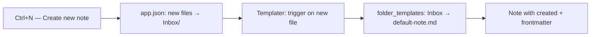

> Related: [[Daily Workflow]] · [[obsidian-default-note-template-plan]] · [[obsidian-setting]]

Yes — that’s exactly right.

`Ctrl+N` works because **three** pieces work together:

| Piece | Where | What it does |
|-------|--------|----------------|
| **1. Default location** | `.obsidian/app.json` → `newFileFolderPath: "Inbox"` | New note lands in `Inbox/` |
| **2. Folder template map** | Templater → Folder Templates (or `data.json` → `folder_templates`) | `Inbox` → `00-Meta/templates/default-note.md` |
| **3. Auto-trigger** | Templater → “Trigger on new file creation” (`trigger_on_file_creation: true`) | Runs the template when the empty file is created |

Plus **`Ctrl+N`** must be bound to **Create new note** in Hotkeys — otherwise that command never runs.

If any one breaks:

- New notes go elsewhere → wrong/no folder template  
- Folder template removed → empty note, no frontmatter  
- Auto-trigger off → empty note unless you insert template manually  
- `Ctrl+N` unbound → shortcut does nothing  

**Daily notes are separate:** `Ctrl+Shift+D` uses **Daily notes** core plugin + `daily-note.md`, not Templater folder templates.
