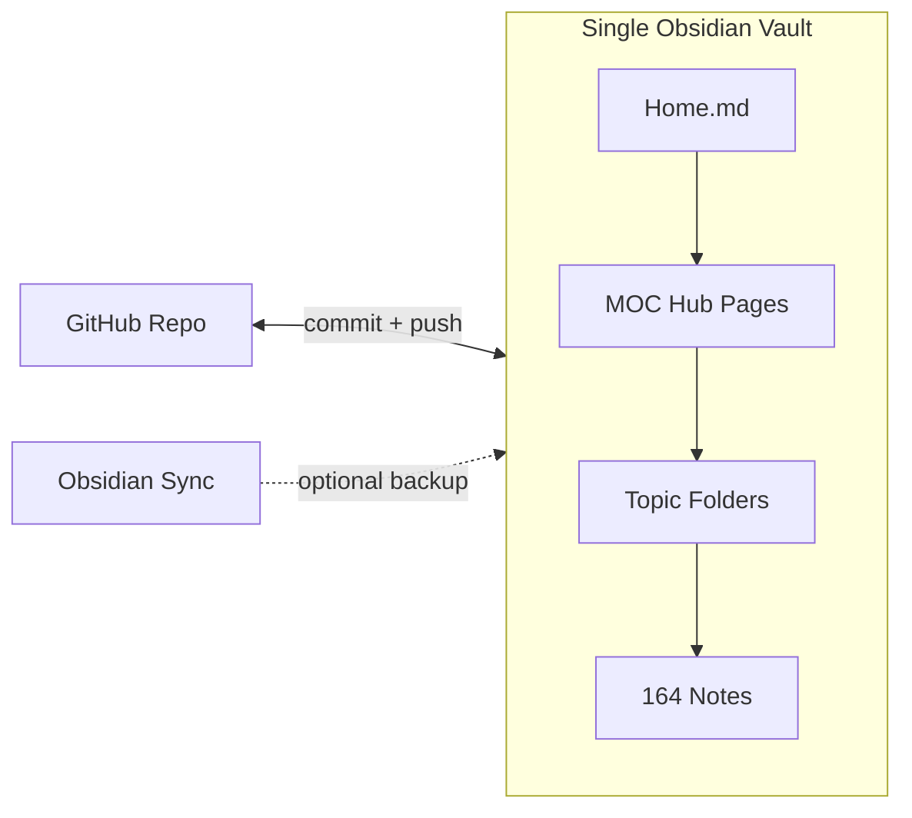
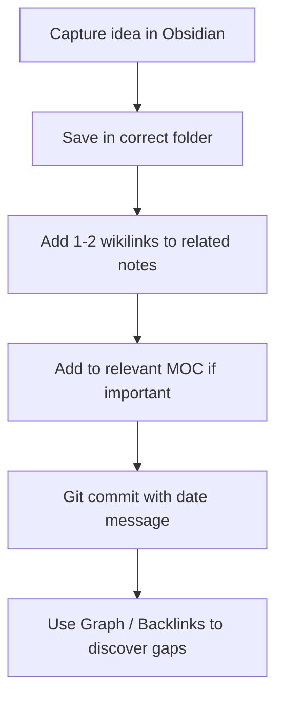

> Related: [[Home]] · [[Daily Workflow]] · [[obsidian-vault-setup-plan]]

# Obsidian Vault Setup (plan reference)

Saved copy of the vault setup plan for quick reference in Obsidian.

---

overview: Turn this flat Git-backed markdown repo into a single Obsidian vault with folder structure, hub (MOC) pages, and wikilinks—so scattered notes become navigable and interconnected. Start with one vault; split personal notes only if privacy requires it.
todos:
  - id: open-vault
    content: Open blog repo as Obsidian vault; configure core settings; commit .obsidian/
    status: completed
  - id: create-mocs
    content: Create 00-Meta/Home.md and initial MOC hub pages (Malcolm, AI Agents, My Stack)
    status: completed
  - id: migrate-folders
    content: git mv notes into topic folders (start with 01-NSM-Malcolm, then remaining batches)
    status: completed
  - id: add-wikilinks
    content: Add high-value wikilinks in Malcolm, threat hunting, and AI clusters
    status: completed
  - id: frontmatter-tags
    content: Add lightweight YAML frontmatter and tag taxonomy to MOCs and new notes
    status: completed
  - id: plugins-workflow
    content: Enable Obsidian Git + Calendar; document daily capture/link workflow
    status: completed
isProject: false
---

# Obsidian Vault Plan for the Blog Repo

## Recommendation: One Vault, Not Many

Your 164 notes already describe one integrated workflow (`[06-08-tools.md](06-08-tools.md)` links Obsidian, Malcolm, Claude, Slack, and Jira together). **Use one technical vault** opened from this repo folder.


| Approach                             | When to use                                                                                                                                                |
| ------------------------------------ | ---------------------------------------------------------------------------------------------------------------------------------------------------------- |
| **One vault (recommended)**          | Default. Folders + MOC pages separate topics without losing cross-links (e.g., Malcolm hunt notes linking to AI agent notes).                              |
| **Second personal vault (optional)** | Only if you want finance/hobby notes (`06-30-bank.md`, `05-12-booklist.md`) excluded from sync/sharing. ~14 files fit `[09-Personal/](#folder-structure)`. |


Multiple vaults add friction for a first-time user. Categories belong in **folders and tags**, not separate vaults.




---

## Current State

- **164 flat `.md` files** at repo root, named `MM-DD-slug.md`
- **Zero wikilinks** (`[[note]]`) and zero cross-file markdown links
- **No `.obsidian/` config** — repo is not yet an Obsidian vault
- **Strong implicit clusters**: Malcolm/NSM (~~30), AI agents (~~32), dev tooling (~~31), threat hunting (~~16)
- Obsidian is mentioned in `[05-13-env-setup.md](05-13-env-setup.md)` and `[06-08-tools.md](06-08-tools.md)` but not integrated

---

## Phase 1: Open Repo as Obsidian Vault (Day 1)

1. Install Obsidian desktop app.
2. **Open folder as vault** → select `[C:\Users\ydnaa\Documents\Github\blog](C:\Users\ydnaa\Documents\Github\blog)`.
3. Obsidian creates `[.obsidian/](.obsidian/)` — commit this to Git so settings travel with the repo.

**Core settings to enable** (`.obsidian/app.json` / Settings UI):

- **Files & Links → New link format:** Shortest path (works well after folder move)
- **Files & Links → Automatically update internal links:** ON (critical before renaming/moving files)
- **Editor → Default view:** Reading or Live Preview (your choice; Live Preview is good for editing + preview)
- **Appearance → Community themes:** Optional; start with default until comfortable

**Git vs Obsidian Sync** (you subscribed to Sync):

- **Git remains source of truth** for this repo (version history, GitHub backup, diff/review).
- **Obsidian Sync** is optional for mobile or a second machine — avoid editing the same note on both Git and Sync simultaneously without pulling first.
- Recommended workflow: edit in Obsidian → `git add` / `commit` / `push` as you do today.

---

## Phase 2: Folder Reorganization

Move files from flat root into topic folders using `**git mv**` to preserve Git history.

### Folder structure

```
blog/
├── .obsidian/
├── 00-Meta/              # Home, MOCs, templates, guidelines
├── 01-NSM-Malcolm/       # ~30 files: Zeek, Suricata, Arkime, OpenSearch, Malcolm
├── 02-Threat-Hunting-DFIR/  # ~16 files: MITRE, forensics, CTF, writeups
├── 03-AI-Agents/         # ~32 files: Claude, Cursor, Hermes, RAG, agents
│   └── Harness-DevSecOps/   # 5 files (disambiguate Harness.io from AI harness)
├── 04-Dev-Environment/   # ~31 files
│   ├── Git/
│   ├── Python/
│   ├── VS-Code/
│   └── Testing/
├── 05-Software-Engineering/  # ~11 files
├── 06-Design-Creative/   # ~10 files
├── 07-Productivity-Work/ # ~7 files
├── 08-Career-Presentations/  # ~7 files
└── 09-Personal/          # ~14 files (optional: move to separate vault later)
```

**Migration rules:**

- Move in batches by folder (one commit per folder) so rollback is easy.
- Turn on **auto-update internal links** before any renames.
- Keep `MM-DD-` prefix initially — rename to semantic slugs only in a later pass (e.g., `05-27-malcolm-orchestration.md` → `malcolm-orchestration.md`).

**Known duplicates to merge or tag during cleanup:**

- `05-08-tracking.md` + `05-08-tracking-ori.md`
- `05-20-python-venv.md` + `05-21-python-venv.md`
- `05-21-ai-workflow.md` + `05-22-ai-workflow.md`
- `05-20-vscode-tips.md` + `05-22-vscode-tips.md`
- `06-10-harness.md` + `06-11-harness.md`

---

## Phase 3: Hub Pages (MOCs) — Highest Leverage Step

Folders alone do not fix discoverability. Create **Map of Content** hub notes in `[00-Meta/](00-Meta/)` that link outward with wikilinks.


| MOC file                       | Links to                                                                                                            |
| ------------------------------ | ------------------------------------------------------------------------------------------------------------------- |
| `Home.md`                      | All MOCs below; set as Obsidian **startup page**                                                                    |
| `MOC - Malcolm & NSM.md`       | `05-27-malcolm-orchestration`, `05-26-zeek-suricata-arkime-opensearch`, `06-03-arkime-api`, OpenSearch/Lucene notes |
| `MOC - OpenSearch Querying.md` | Lucene, DSL, filter, request notes                                                                                  |
| `MOC - Threat Hunting.md`      | `06-04-threat-hunt-evolution`, `05-08-mitre`, forensic notes, `07-07-writeup-guideline`                             |
| `MOC - AI Agents.md`           | `06-10-NICSA-ai-framework-v1`, `06-10-agent-framework`, context/RAG notes                                           |
| `MOC - Claude & Cursor.md`     | `05-22-cursor-vs-claude`, `06-09-claude-skills`, `06-08-claude-design`, `06-06-CLAUDE`                              |
| `MOC - Dev Environment.md`     | `05-13-env-setup`, git/python/vscode/testing notes                                                                  |
| `My Stack.md`                  | Expand existing `[06-08-tools.md](06-08-tools.md)` into a living tool index                                         |


**Example hub snippet for `Home.md`:**

```markdown
# Knowledge Base

## Work
- [[MOC - Malcolm & NSM]]
- [[MOC - Threat Hunting]]
- [[MOC - AI Agents]]

## Tools & Workflow
- [[My Stack]]
- [[MOC - Claude & Cursor]]
- [[MOC - Dev Environment]]
```

---

## Phase 4: Add Wikilinks (Gradual, High-Value First)

Today there are **zero** `[[wikilinks]]`. Add them incrementally — do not try to link all 164 notes at once.

**Priority link clusters:**

1. All Malcolm/OpenSearch/Arkime notes ↔ `[[MOC - Malcolm & NSM]]`
2. `06-04-threat-hunt-evolution` ↔ `05-08-mitre` ↔ forensic notes
3. Every AI workflow note → `[[CLAUDE]]` (your agent instruction template)
4. Tool mentions in body text → `[[My Stack]]` or specific tool notes

**Obsidian features unlocked by linking:**

- **Graph view** — visual map of how topics connect
- **Backlinks panel** — see what references a note
- **Unlinked mentions** — Obsidian suggests links for text that matches note titles

---

## Phase 5: Metadata (Lightweight Frontmatter)

Add YAML frontmatter to new notes and high-value existing ones (not all 164 at once):

```yaml
---
created: 2026-05-27
tags: [malcolm, opensearch]
type: reference
lang: en
status: draft
---
```

**Suggested tags** (use Obsidian tag pane + search):

- `#project/malcolm-bec`, `#tool/obsidian`, `#type/howto`, `#type/reference`
- `#lang/en`, `#lang/zh` (many notes are bilingual)
- `#status/draft` vs `#status/published`

This aligns with your `[06-09-YAML-markdown.md](06-09-YAML-markdown.md)` note and supports future filtering without rigid folder lock-in.

---

## Phase 6: Plugins (Start Minimal)

As a new subscriber, install only what you need now. Add threat-intel plugins later when you actively hunt.

### Core (enable first)


| Plugin           | Purpose                                                   |
| ---------------- | --------------------------------------------------------- |
| **Obsidian Git** | Auto-commit/push on interval (complements manual commits) |
| **Tag Wrangler** | Rename/merge tags as taxonomy evolves                     |
| **Calendar**     | Daily notes aligned with your `MM-DD-` capture habit      |


### Optional (after 2–4 weeks)


| Plugin        | Purpose                                                                       |
| ------------- | ----------------------------------------------------------------------------- |
| **Templater** | New note from `06-06-CLAUDE.md` / writeup templates                           |
| **Dataview**  | Query notes by frontmatter (`type: reference` in Malcolm folder)              |
| **Canvas**    | Attack-surface maps (mentioned in `[05-13-env-setup.md](05-13-env-setup.md)`) |


### Threat intel (when ready — per `[06-08-tools.md](06-08-tools.md)`)

- **IOC Lens**, **SOC Toolkit**, **VirusTotal Enrichment** — for local threat KB with IOC parsing
- Keep IOC-heavy hunt notes in `[02-Threat-Hunting-DFIR/](02-Threat-Hunting-DFIR/)` or a future `Threat-Actors/` subfolder

---

## Phase : Daily Workflow (How You Actually Use It)




**Practical habits:**

1. **New notes:** Start from `Home.md` or the relevant MOC; link before you finish.
2. **Existing scattered notes:** When you open one to reference it, add 2–3 wikilinks — "link as you go."
3. **Weekly:** Open Graph view, find orphan notes (no links), connect or archive.
4. **Duplicates:** Merge content, add `#archived` tag, or move to `09-Personal/`.

---

## What NOT to Do (Avoid Common Pitfalls)

- **Do not create 5+ vaults** — folders and MOCs are enough.
- **Do not rename all files on day one** — move to folders first; semantic renames later.
- **Do not install 20 community plugins** — causes noise and maintenance burden.
- **Do not replace Git with Sync** — keep Git as canonical for this public repo.
- **Do not add an SSG or build step yet** — Obsidian value is navigation and linking, not publishing.

---

## Success Criteria

You will know Obsidian is working when:

1. Opening `**Home.md**` gives you a navigable entry point to all major topics.
2. **Graph view** shows clusters (Malcolm, AI, Dev) instead of 164 isolated nodes.
3. You can find related notes via **backlinks** when working on Malcolm BEC or agent projects.
4. New captures land in the right folder with at least one wikilink.
5. Git history is intact after folder migration (`git log --follow` still works).

---

## Implementation Order (Suggested)

1. Open vault + commit `.obsidian/` config
2. Create `00-Meta/Home.md` and top 3 MOCs (Malcolm, AI Agents, My Stack)
3. Move `01-NSM-Malcolm/` batch + link those notes to MOC
4. Move remaining folders in priority order
5. Add frontmatter to MOCs and templates only
6. Enable Obsidian Git + Calendar
7. Gradual wikilink pass + duplicate cleanup
8. Optional: threat-intel plugins and Canvas when actively hunting

Estimated effort: **~2–3 hours** for setup + first folder batch; **ongoing** light linking as you use notes.