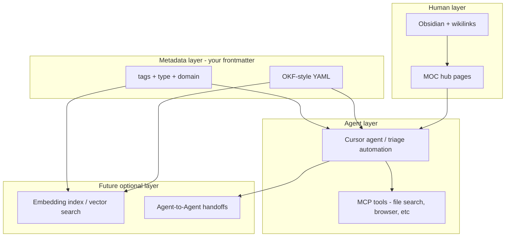
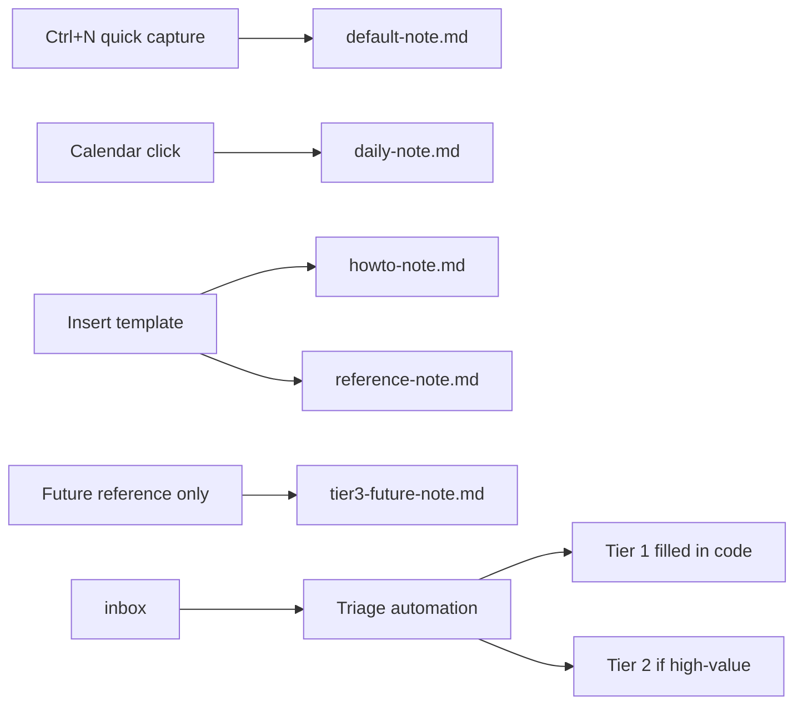
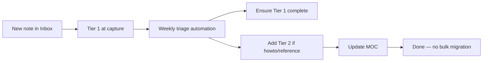

> Related: [[frontmatter-schema]] · [[inbox-triage-rules]] · [[yaml-okf]]

# Frontmatter Schema: Advice and Improvement Plan

## Plan metadata

- **Name:** Frontmatter Schema Advice
- **Overview:** Your expanded frontmatter is directionally right for OKF-style agent-readable knowledge, but several fields conflate different layers (RAG vs MCP vs A2A), conflict with existing vault conventions, and are not yet wired into templates or scripts. This plan realigns the schema into tiers, fixes inconsistencies, and maps each AI concept to what it actually optimizes in your vault.
- **Project:** false

### Original todo list

- [ ] Rewrite `inbox-triage-rules.md`: Tier 1/2/3, checklist fixes, concept map, remove `relations`/`domain` duplication
- [ ] Sync `default-note.md` and `daily-note.md` to Tier 1
- [ ] Create `howto-note.md`, `reference-note.md`, and `tier3-future-note.md`
- [ ] Create `frontmatter-schema.md` as canonical tier/design-principle reference
- [ ] Update `Tag Taxonomy.md` with concept type and frontmatter reference
- [ ] Extend `build-vault-canvas.py` to use `description`/`updated` in node metadata
- [ ] Apply the new schema to an example triaged note

## What you got right

Your instinct matches what your own notes already describe in [[yaml-okf]] and [[rag-okf-wiki]]:

- **Structured metadata before body text** → agents filter without reading full notes (token efficiency)
- **`title` + `description`** → best ROI fields for semantic retrieval (Cursor search, future embeddings)
- **`type`** → routing (howto vs reference vs hub)
- **`updated`** → stale-knowledge detection (called out in your OKF wiki note as "knowledge drift")
- **MOC hub pages** → you already have OKF-style `index.md` maps ([[MOC - AI Agents]], etc.)

You do **not** need a vector database to benefit from this. For your vault today, the "RAG" layer is mostly: grep + `@` file references + MOC navigation + frontmatter filtering.

---

## Concept map: what each idea actually does here



| Concept | What it is | What frontmatter helps | What frontmatter does NOT do |
|---------|-----------|------------------------|------------------------------|
| **OKF** | Minimal YAML + markdown wiki pattern | `type`, `title`, `description`, folder/MOC maps | Replace wikilinks or MOC curation |
| **RAG** | Retrieve relevant chunks at query time | `description`, `tags`, `domain` improve retrieval quality | Run retrieval by itself — you still need a search tool or embedding pipeline |
| **MCP** | Protocol for tools (read files, APIs, browser) | `type` helps agents *choose which file to read* | "Route MCP" — MCP routes **tool calls**, not note types |
| **A2A** | Agents talking to other agents | `prerequisites`, `relations` can support handoff context | Enable multi-agent orchestration — that needs agent runtime design |

**Key insight:** Your schema is really an **OKF + vault conventions** layer. RAG/MCP/A2A benefit *indirectly* when agents can find the right note faster. Don't label fields as "for MCP routers" unless you build an MCP server that reads them.

---

## Problems in the current draft

### 1. Internal inconsistencies in [[inbox-triage-rules]]

| Location | Says | Conflict |
|----------|------|----------|
| Frontmatter schema | `draft: true` | Per-file checklist (line 76) still says `status` |
| Existing vault (~164 notes) | `status: draft \| published` | New schema drops `status` |
| [[Tag Taxonomy]] | Domain lives in `tags` array | New `domain:` field duplicates taxonomy |
| Body convention | `Related: [[MOC]]` + wikilinks | New `relations: []` duplicates graph edges |
| [[default-note]] | Old 5-field template | Not synced with new schema |

### 2. Field design issues

- **`relations: []`** — fragile if stored as bare slugs (collisions across folders). Prefer wikilinks in body + MOC entries; only add `relations` if you define vault-relative paths (`03-AI-Agents/yaml-okf`).
- **`domain: tech/ai`** — overlaps `#type/*`, `#lang/*`, and existing tag list. Pick **one** primary mechanism; recommend keeping domain as **tags** per Tag Taxonomy, with optional `domain` only if you want hierarchical namespaces later.
- **`visibility: private`** — good intent, zero enforcement today. Without a `.cursorignore` or MCP filter, agents still read everything. Pair with ignore rules if this matters.
- **`prerequisites: []`** — high value for complex howtos, but triage automation will guess wrong often. Make **optional Tier 2**, not required on every inbox note.
- **`type: concept`** — not in Tag Taxonomy (`reference | howto | hub | daily`). Add it there if you adopt it.

### 3. Nothing consumes the new fields yet

[`scripts/build-vault-canvas.py`](../scripts/build-vault-canvas.py) only reads `tags` and `type`. [`scripts/rename-dates.py`](../scripts/rename-dates.py) builds the old 5-field block. Until scripts/automation read new fields, they are documentation-only.

---

## Recommended schema: three tiers

Since you chose **all goals** (Cursor triage + Dataview + future RAG), use a tiered model — require less at capture time, enrich at triage time.

### Tier 1 — Required on every triaged note

```yaml
---
title: "Human-readable title"           # infer from first H1 or filename
description: "One sentence: what + why" # NEW — highest ROI for search/RAG
created: YYYY-MM-DD
updated: YYYY-MM-DD                     # set to triage date if missing
type: reference                         # reference | howto | hub | daily | concept
lang: en                                # en | zh
status: draft                           # KEEP status — matches 164 existing notes
tags: [ai, workflow]                    # from Tag Taxonomy — includes domain
---
```

**Why keep `status` over `draft: true`:** Obsidian Dataview, existing MOCs, and migration cost all use `status`. Use `status: draft` instead of a boolean.

### Tier 2 — Add during triage for high-value notes (howtos, references agents will reuse)

```yaml
prerequisites: []        # wikilink slugs: [yaml-markdown, tag-taxonomy]
summary: ""              # optional 2-3 bullet key takeaways (better than long description for agents)
```

Skip `relations:` — your `Related:` block + wikilinks + MOC updates already build the graph (OKF pattern). Duplicating in YAML creates drift.

### Tier 3 — Future / optional (RAG pipeline, team sharing)

```yaml
visibility: private      # private | internal | public
embedding: true          # opt-out stale notes from vector index
canonical: true          # mark authoritative note when duplicates exist
```

Add these only when you build the consumer (embedding script, MCP vault-search tool, or visibility filter).

---

## How each tier maps to your goals

| Goal | What to prioritize |
|------|-------------------|
| **Cursor triage automation** | Tier 1 + `description` + correct MOC link; triage rules already handle routing |
| **Obsidian Dataview** | `type`, `status`, `tags`, `created`, `updated` — all Tier 1 |
| **Future vector RAG** | `description`, `tags`, `updated`, optional `embedding: false` to exclude drafts |
| **A2A / multi-agent** | MOC maps + `prerequisites` on complex notes; agent handoff is runtime design, not YAML alone |

---

## Concrete file changes (after plan approval)

### 1. Rewrite Frontmatter section in [[inbox-triage-rules]]

- Replace current schema block with Tier 1 + Tier 2 optional block
- Fix per-file checklist: `status` not `draft`; add `title`, `description`, `updated`
- Add short "Concept map" subsection (OKF/RAG/MCP/A2A — what each field actually serves)
- Remove misleading comment "vital for MCP routers" → "helps agents pick note type before reading body"
- Document: **do not add `relations`** — use wikilinks + MOC instead

### 2. Sync existing templates in `00-Meta/templates/`

**Yes — modify both existing templates.** Templates only affect *new* notes ([[Daily Workflow]]), so syncing them is low-risk and keeps capture aligned with triage rules.

| Template | Role | Change |
|----------|------|--------|
| [[default-note]] | Auto-applied on `Ctrl+N` via Templater | Tier 1 minimal — add `updated`, restore `type: reference` |
| [[daily-note]] | Calendar daily notes | Add `updated: {{date:YYYY-MM-DD}}` to match Tier 1 |

**`default-note.md`** — Tier 1 only at capture (keep Templater dynamic date):

```javascript
tR = `---
created: ${date}
updated: ${date}
tags: []
type: reference
lang: en
status: draft
---

# 

`;
```

Do **not** put `title`/`description` in the hot-path template — infer at triage from H1/body (less friction at `Ctrl+N`).

**`daily-note.md`** — add one line only:

```yaml
updated: {{date:YYYY-MM-DD}}
```

Daily notes stay `type: daily`; triage rules already skip `daily/` promotion.

### 3. New canonical doc: [[frontmatter-schema]]

**Best place:** a dedicated meta reference — not buried in triage rules or Tag Taxonomy alone.

| Doc | Role after this change |
|-----|------------------------|
| **`frontmatter-schema.md`** (new) | Canonical schema: Tier 1/2/3, design principles, template index, OKF/RAG concept map |
| [[Tag Taxonomy]] | Tags and `type` values only — links to `frontmatter-schema` for full field list |
| [[inbox-triage-rules]] | Triage automation rules — links to `frontmatter-schema`, keeps a short Tier 1 reminder |
| [[YAML-markdown]] | YAML syntax — unchanged |
| [[yaml-okf]] | OKF concept background — `frontmatter-schema` links here for "why" |

**`frontmatter-schema.md` contents:**

1. **Tier 1 / 2 / 3** field tables (from this plan)
2. **Design principles** section — the five "What NOT to do" rules, expanded:

   | Principle | Rule |
   |-----------|------|
   | Metadata before RAG | Don't build vector RAG before structured metadata — fix `title`, `description`, MOC links first |
   | One graph | Don't duplicate the link graph in YAML — wikilinks + MOCs are the OKF index; `relations:` will drift |
   | Consumer required | Don't add fields without a reader — each field needs a triage prompt, Dataview query, or script |
   | MCP ≠ metadata | Don't conflate MCP with metadata — MCP routes tools; frontmatter helps file *selection* |
   | Touch-only migration | Don't bulk-migrate ~164 notes — enrich on triage touch only |

3. **Template index** — which template for which flow (see section 4 below)
4. **Related links** — Tag Taxonomy, inbox-triage-rules, yaml-okf, Daily Workflow

Add to [[Home]] or [[Daily Workflow]] under meta references.

### 4. Templates in `00-Meta/templates/`

**Modify existing** (section 2 above) plus **three new** files:



| Template | When to use | Tier |
|----------|-------------|------|
| **`howto-note.md`** | Manual — step-by-step guide | 1 + 2 + body scaffold |
| **`reference-note.md`** | Manual — durable reference / concept | 1 + 2 + body scaffold |
| **`tier3-future-note.md`** | **Reference only** — do not insert until a consumer exists | 1 + 2 + 3 placeholder |

**`tier3-future-note.md`** — placeholder for future RAG / sharing pipeline:

```yaml
---
# Tier 3 fields — NOT ACTIVE until a script or MCP tool reads them.
# See 00-Meta/frontmatter-schema.md § Tier 3
title: ""
description: ""
created: YYYY-MM-DD
updated: YYYY-MM-DD
type: reference
lang: en
status: draft
tags: []
prerequisites: []
summary: ""
visibility: private      # private | internal | public — pair with .cursorignore when enforced
embedding: true          # false = exclude from future vector index
canonical: true          # true = authoritative when duplicates exist
---
```

Include a short HTML comment or markdown callout at top of template body:

> **Placeholder template.** Tier 3 fields have no consumer yet. Copy fields manually when building embedding pipeline or visibility filters. Do not auto-apply via Templater.

Document all five templates in `frontmatter-schema.md` § Templates and a short list in `Daily Workflow.md`.

### 5. Extend [[Tag Taxonomy]]

- Add `concept` to type list if adopted
- Replace duplicated field tables with link: *See [[frontmatter-schema]] for Tier 1/2/3 fields and design principles*
- Clarify: domain = tags, not separate `domain:` field

### 6. Optional script enhancement (Phase 2)

Extend [`scripts/build-vault-canvas.py`](../scripts/build-vault-canvas.py) `parse_frontmatter` usage to surface `description` and `updated` in canvas node labels — makes the investment visible without building embeddings yet.

### 7. Example: triage the inbox test note

An inbox note such as `industry-standard-for-ai-human-collaboration.md` would become:

```yaml
---
title: "Industry Standard for AI & Human Collaboration"
description: "Decoupled execution via draft PRs, plan-first workflows, and atomic commits when using AI agents."
created: 2026-07-09
updated: 2026-07-09
type: reference
lang: en
status: draft
tags: [ai, agents, workflow, git]
---
```

Route to `03-AI-Agents/`, link `Related: [[MOC - AI Agents]]`, add wikilinks to [[CLAUDE]], [[Daily Workflow]].

---

## Migration strategy (avoid big-bang rewrite)



- **New/triaged notes:** full Tier 1; Tier 2 when valuable
- **Existing 164 notes:** leave as-is until touched; add `description` opportunistically
- **Never require** `prerequisites`, `visibility`, or `relations` on short inbox captures

---

## What NOT to do (common beginner traps)

Documented in full in [[frontmatter-schema]] § Design principles. Summary:

1. **Don't build vector RAG before structured metadata** — fix titles, descriptions, MOC links first (cheaper, immediate Cursor benefit)
2. **Don't duplicate the link graph in YAML** — wikilinks + MOCs are your OKF index; YAML relations will drift
3. **Don't add fields without a consumer** — each new field needs a reader (triage prompt, Dataview query, or script)
4. **Don't conflate MCP with metadata** — MCP is tools; metadata helps file *selection*
5. **Don't migrate all notes at once** — enrich on triage touch only

Tier 3 fields live in [[tier3-future-note]] as a **reference placeholder** until embedding or visibility consumers exist.

---

## Success criteria

After changes, a triage run should produce notes where:

1. Every moved file has Tier 1 frontmatter with no `status`/`draft` conflict
2. [[frontmatter-schema]] exists as canonical reference with design principles
3. `default-note.md`, `daily-note.md`, and triage rules agree on Tier 1
4. `howto-note.md`, `reference-note.md`, and `tier3-future-note.md` exist in templates/
5. Agent can grep `description:` or `type: howto` and get meaningful filters
6. MOC + wikilinks carry graph relationships (no parallel `relations` array)
7. Tag Taxonomy links to frontmatter-schema (no duplicated field tables)


