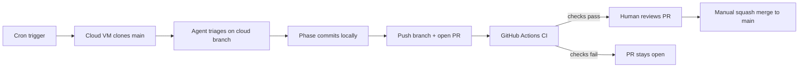

> Related: [[MOC - Dev Environment]] · [[automation-pr-merge-policy]] · [[automation-prompt-suggestion]]
---
name: Fix triage automation workflow
overview: Keep the Cursor-compatible cloud-branch PR workflow, but stop daily triage at PR creation so a human reviews and merges manually after CI.
todos:
  - id: restore-finish-script
    content: Keep finish-ai-task.sh on cloud-branch PR flow without auto-merge; extract validate-triage-paths.sh
    status: pending
  - id: add-triage-ci
    content: Add .github/workflows/triage-validation.yml (path guardrails + build-vault-canvas.py)
    status: pending
  - id: fix-automation-docs
    content: Update automation docs to recommend Mode 3 (PR + manual review) for daily triage
    status: pending
  - id: github-settings
    content: Document branch protection requiring triage-validation check before manual merge
    status: pending
  - id: verify-e2e
    content: Verify finish script guardrails and CI workflow on a test PR branch
    status: pending
isProject: false
---

# Fix Daily Triage Automation Workflow

## Verdict on your proposed workflow

**Use PR + manual review after checks for `daily-triage-automation`.**

Cursor scheduled automations clone `main` but work on an ephemeral cloud branch (your prior run used `cursor/daily-inbox-triage-9370`, merged in PR #5). Direct push to `main` is incompatible with that model because:

- The agent is not reliably on `main` at finish time
- Changes would stay on the cloud branch unless explicitly pushed via PR
- Commit `8e9f320` inverted [`scripts/finish-ai-task.sh`](scripts/finish-ai-task.sh) to *require* `main` and `git push origin main`, which contradicts how Cursor Cloud actually runs

The correct review-first flow:



This keeps `main` protected and gives you a review point before triage changes land.

---

## What went wrong (commit `8e9f320`)

| Area | Before (correct for Cursor) | After (broken) |
|------|----------------------------|----------------|
| [`scripts/finish-ai-task.sh`](scripts/finish-ai-task.sh) | Refuse `main`; push `cursor/*` or `automation/*` branch; open PR; merge | Require `main`; direct `git push origin main` |
| [`automation-pr-merge-policy.md`](04-Dev-Environment/Git/automation-pr-merge-policy.md) | Mode 2 for daily triage | Mode 1 (direct push) for daily triage |
| Prompt docs | Branch + PR finish | "Run on main, no PR" |

---

## Implementation plan

### 1. Restore and harden `finish-ai-task.sh`

Keep branch-based finish logic, with improvements:

- **Branch guard:** refuse `main`; allow `cursor/daily-inbox-triage*` and `automation/daily-inbox-triage*`
- **Keep path allowlist** from the direct-main version (good safety addition)
- **Push branch** → **create PR if missing**
- **Do not enable auto-merge**; leave merge to manual review
- **Do not** `git checkout main` at the end (docs already flag this as risky in agent contexts)
- **Extract** path validation into shared [`scripts/validate-triage-paths.sh`](scripts/validate-triage-paths.sh) used by both finish script and CI

### 2. Add GitHub Actions CI (new)

Create [`.github/workflows/triage-validation.yml`](.github/workflows/triage-validation.yml):

- **Trigger:** `pull_request` targeting `main`, when head branch matches `cursor/daily-inbox-triage*` or `automation/daily-inbox-triage*`
- **Jobs:**
  1. **Path guardrails** — run `bash scripts/validate-triage-paths.sh` against `origin/main...HEAD`
  2. **Vault map build** — `python scripts/build-vault-canvas.py --all` (catches broken graph/index generation after file moves)
- **Job name** should be stable (e.g. `triage-validation`) so branch protection can require it

### 3. Keep manual review in GitHub (repo settings)

Document the expected settings:

1. **Branch protection on `main`** (recommended so checks actually gate merge):
   - Require status check: `triage-validation`
   - Keep human review/merge as the final step

If branch protection cannot be set via CLI (permissions), document the exact GitHub UI steps in [`automation-pr-merge-policy.md`](04-Dev-Environment/Git/automation-pr-merge-policy.md).

### 4. Fix documentation (8 files from `8e9f320` + related notes)

Update all references to "cloud branch → PR → manual review":

| File | Change |
|------|--------|
| [`automation-pr-merge-policy.md`](04-Dev-Environment/Git/automation-pr-merge-policy.md) | Daily triage → **Mode 3**; document PR + manual review |
| [`automation-prompt-suggestion.md`](03-AI-Agents/automation-prompt-suggestion.md) | Replace finish-script prompt with cloud-branch push + PR creation |
| [`agent-pr-squash-and-merge.md`](04-Dev-Environment/Git/agent-pr-squash-and-merge.md) | Reframe as PR finish script (title/description already mismatched) |
| [`inbox-triage-rules.md`](00-Meta/inbox-triage-rules.md) | Git policy: commit on cloud branch, finish via manual-review PR |
| [`Daily Workflow.md`](00-Meta/Daily Workflow.md) | Step 3: PR manual review, not direct push |
| [`MOC - Dev Environment.md`](00-Meta/MOC - Dev Environment.md) | Fix link descriptions |
| [`cursor-cloud-sandbox-trap.md`](03-AI-Agents/cursor-cloud-sandbox-trap.md) | Make PR + manual review the primary fix; demote direct-main push |
| [`pr-auto-merge-policy-gh-pr-create.md`](04-Dev-Environment/Git/pr-auto-merge-policy-gh-pr-create.md) | Update verdict: PR + manual review for Cursor Automation; direct push only for non-Cursor contexts |

**Cursor Automation prompt** (for you to paste into the Automations UI after merge):

```
Read inbox-triage-rules.md and Daily Workflow.md. Organize Inbox/ per rules.

1. Work on the current cloud branch (do NOT checkout main).
2. Commit by phase after each major milestone.
3. Verify: clean tree, trusted paths only, validation passes.
4. Push the current branch and open a PR to main.
   Do not enable auto-merge; wait for manual review.
```

Automation **target branch** stays `main` (base branch to clone); the agent finishes on the cloud branch Cursor creates.

### 5. Verify end-to-end

After changes land:

1. Dry-run `validate-triage-paths.sh` locally against a sample diff
2. Push a test branch + open PR → confirm `triage-validation` workflow runs
3. Confirm CI passes and the PR remains open for manual review
4. Confirm finish script fails closed on wrong branch, dirty tree, or disallowed paths

---

## Files touched (summary)

- **Restore/rewrite:** [`scripts/finish-ai-task.sh`](scripts/finish-ai-task.sh)
- **New:** [`scripts/validate-triage-paths.sh`](scripts/validate-triage-paths.sh), [`.github/workflows/triage-validation.yml`](.github/workflows/triage-validation.yml)
- **Docs:** 8 markdown files listed above

No changes to vault content or unrelated scripts.
