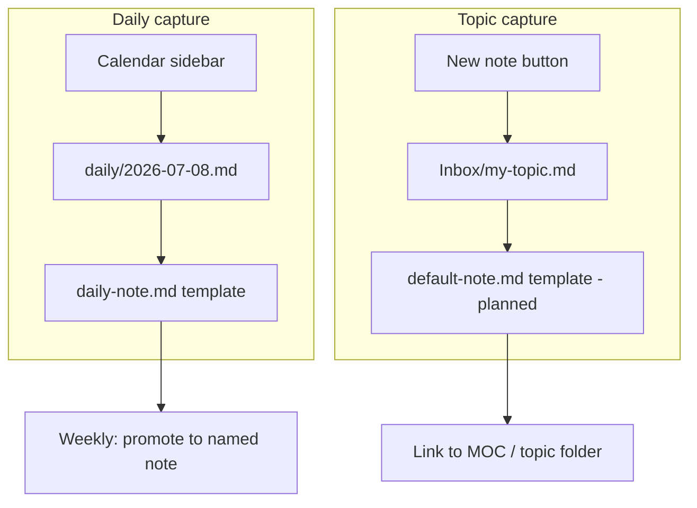

```mermaid
flowchart TB
  subgraph dailyFlow [Daily capture]
    Cal[Calendar sidebar]
    Cal --> DailyFile["daily/2026-07-08.md"]
    DailyFile --> DailyTpl["daily-note.md template"]
  end
  subgraph topicFlow [Topic capture]
    NewNote[New note button]
    NewNote --> SlugFile["Inbox/my-topic.md"]
    SlugFile --> DefaultTpl["default-note.md template - planned"]
  end
  DailyTpl --> Promote["Weekly: promote to named note"]
  DefaultTpl --> MOC["Link to MOC / topic folder"]

```
