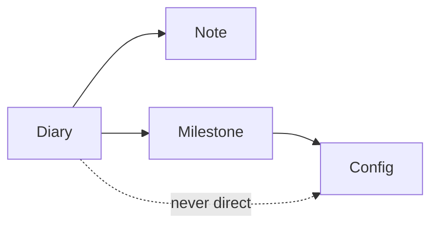

## Survey: text vs diagram for DIARY promotion

  

### Context that matters first

  

[`DIARY/README.md`](DIARY/README.md) is **human-only** (`audience: human`). Agents are told not to execute from it ([`CLAUDE.md`](CLAUDE.md)). So “agent-friendly” here means: *if an agent reads it for context*, can it reliably understand the promotion rules — not *should agents follow it as procedure*.

  

Your repo already has a split pattern:

  

| Layer | Format | Who it's for |

| --- | --- | --- |

| [`docs/config/`](docs/config/) | Imperative text | Agent procedure |

| [`docs/note/*-diagrams.md`](docs/note/malcolm-threat-hunt-workflow-diagrams.md) | Mermaid in markdown | Human visual + readable source |

| [`assets/reference/*.svg`](assets/reference/ai-framework-blueprintf/overview.svg) | Polished SVG | Human reference |

  

That pattern is the best precedent for your question.

  

---

  

### Format comparison (agent lens)

  

| Format | Agent can parse structure? | Token cost | Human scan speed | Repo fit |

| --- | --- | --- | --- | --- |

| **Numbered list / table (current)** | Excellent — paths and rules are explicit text | Low | Good for rules, weaker for flow | Matches agent-doc style |

| **Mermaid in markdown** | Good — nodes/edges are plain text in the file | Low–medium | Good flow at a glance | Already used for promotion-like flows ([`human-agnet-doc-workflow.md`](docs/note/human-agnet-doc-workflow.md)) |

| **SVG (inline or linked)** | Weak–medium — depends on whether agent reads raw XML | Medium–high | Best visual clarity | Only 2 SVGs today; they're polished references, not conventions |

| **SVG embedded as `` only** | Poor — agent often sees only alt text | Low in MD, high if file opened | Nice in GitHub UI | Worst unless paired with text |

  

---

  

### SVG specifically

  

**Pros (your preference is valid):**

- Cleanest visual for humans in GitHub / IDE preview

- Your existing SVGs ([`overview.svg`](assets/reference/ai-framework-blueprintf/overview.svg)) are well done: `<title>`, `<desc>`, labeled nodes — better than bare decorative SVG

  

**Cons (agent-friendly):**

- Agents read **coordinates + paths**, not layout intuition — inferring “never direct to config” from arrow geometry is unreliable

- Higher token cost if the agent opens the full SVG

- Harder to grep (`docs/logs/milestone` won't match inside SVG paths)

- Drift risk: SVG and text can diverge unless one is clearly canonical

  

**Verdict for SVG alone:** Human-favorable, **not** agent-favorable as the single source of truth.

  

---

  

### Mermaid vs SVG for this use case

  

For a 4-node promotion flow, **mermaid wins on agent-friendliness** because the diagram *is* text:

  

  

An agent reading that gets the same edges you see rendered. Your repo already treats mermaid this way in [`docs/note/malcolm-threat-hunt-workflow-diagrams.md`](docs/note/malcolm-threat-hunt-workflow-diagrams.md) — explicitly “human diagrams, not agent procedure,” but still machine-readable source.

  

SVG is better when you need **design polish** (zones, styling, complex layout) — like your AI framework blueprints — not for a small convention box in DIARY README.

  

---

  

### Recommendation for DIARY promotion

  

**Hybrid, text-first** (best of both):

  

1. **Keep the short numbered list + table** as canonical (what you have now) — agents and grep win

2. **Add a tiny mermaid block** under it for human flow — same info, zero drift if you copy nodes from the list

3. **Skip SVG for DIARY README** unless you later extract a shared diagram used in multiple human docs

  

If you really want SVG aesthetics, do **text + SVG**, never SVG alone — and put a rich `<desc>` in the SVG mirroring the numbered rules (like `overview.svg` does).

  

---

  

### Practical rule of thumb for this repo

  

| Doc type | Primary | Optional visual |

| --- | --- | --- |

| Agent procedure (`docs/config/`) | Text only | None |

| Human convention (DIARY README) | Text/table | Mermaid |

| Human architecture / engagement deck | Text summary | SVG in `assets/reference/` |

  

**Bottom line:** For promotion in DIARY, your instinct toward a diagram is right for *you*; for *agents*, keep text as source of truth and use **mermaid** as the diagram format. Pure SVG is the nicest to look at but the weakest as sole documentation unless duplicated by explicit text.

  

If you want, I can add a one-block mermaid under the Promotion section in [`DIARY/README.md`](DIARY/README.md) without removing the text — small diff, no new files.

