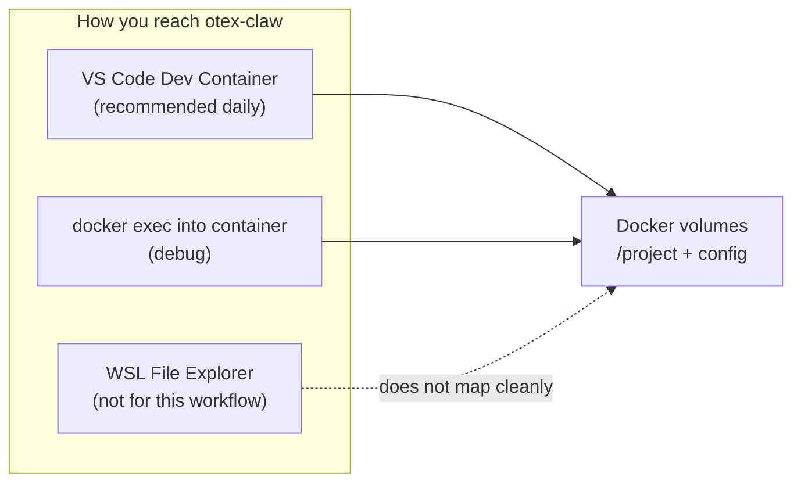

## Old workflow vs Dev Container

You used to work like this:

```text
Win11  ←→  File Explorer (\wsl$\Ubuntu\...)  ←→  /home/you/project
Win11  ←→  VS Code "WSL Remote"              ←→  same folder
```

Everything lived in **WSL’s normal filesystem**. Explorer and VS Code both pointed at the same place.

**Dev Container (Clone in Container Volume)** is different:

```text
Win11 / WSL home (/home/inforensic)     ←  NOT where otex-claw lives
         ↓
WSL Ubuntu runs Docker
         ↓
Docker volumes (hidden storage)         ←  otex-claw code lives HERE
         ↓
Container filesystem (/workspaces/otex-claw)
         ↓
VS Code "Dev Container" attaches here     ←  primary way to interact
```

Your screenshot shows `/home/inforensic` in WSL — that is the **Docker host**, not the project. No `otex-claw` folder there is expected.

---

## Where your files actually are

From your container mounts:

| What | Inside container | Physical storage |
|------|------------------|------------------|
| **Project code** | `/workspaces/otex-claw` | Docker volume `otex-claw-main-04b7d1c8...` |
| **Config** (incl. sensitive-patterns) | `/home/vscode/.config/otex-claw/` | Docker volume `otex-claw-config` |
| **Claude login state** | `/home/vscode/.claude/` | Docker volume `otex-claw-claude-state` |

These sit under WSL at something like:

```text
/var/lib/docker/volumes/otex-claw-main-.../_data
```

That path exists, but it is **not** meant for daily browsing — it is Docker-managed blob storage.

---

## How to interact with the Docker dev env

### 1. VS Code attached to Dev Container (main UI)

This replaces “WSL Remote” as your primary interface.

- Bottom-left badge: **`Dev Container: otex-claw`**
- **Left Explorer** = edit files in `/workspaces/otex-claw`
- **Integrated terminal** (`Ctrl+` `) = shell **inside** the container
- **Source Control** = git in the container
- **Extensions** run mostly inside the container

Open it again anytime:

- **File → Open Recent → otex-claw [Dev Container]**
- or `F1` → **Dev Containers: Open Recent Folder in Container...**

### 2. Container terminal (your “Linux shell”)

When VS Code says `Dev Container: otex-claw`, the terminal **is** the dev environment:

```bash
pwd                          # /workspaces/otex-claw
otex-claw --help
ls ~/.config/otex-claw/
```

Do not expect `cd ~` to show project files — home is `/home/vscode`, project is `/workspaces/otex-claw`.

### 3. Remote Explorer sidebar (VS Code)

Click the **Remote Explorer** icon → **Dev Containers** / **Dev Volumes**:

- See running/stopped containers
- Reattach or reopen volumes
- Useful when “Open Recent” does not list otex-claw

### 4. WSL terminal + `docker` (admin / debug only)

From Ubuntu WSL:

```bash
docker ps                              # is container running?
docker exec -it youthful_villani bash  # drop into container shell (no VS Code UI)
docker volume ls                       # list volumes
```

This is for troubleshooting, not day-to-day editing.

### 5. Win11 File Explorer — limited use here

| Path | Useful for Dev Container? |
|------|---------------------------|
| `\wsl$\Ubuntu-24.04\home\inforensic\` | **No** — not project location |
| `\wsl$\Ubuntu-24.04\var\lib\docker\volumes\...` | Technically yes, **not recommended** — raw volume data, easy to corrupt |

For this onboarding flow, **do not** use Explorer to manage otex-claw files. Use VS Code while attached to the container.

---

## Mental model: three “doors”



- **WSL Remote** = door opens directly into `/home/you/project`
- **Dev Container Volume** = door opens into a **container**, project is on a **volume** behind it

---

## Practical daily checklist

1. Start Ubuntu WSL once: `wsl -d Ubuntu-24.04` (Docker up)
2. Open VS Code → **Open Recent → otex-claw [Dev Container]**
3. Wait for bottom-left to show **Dev Container: otex-claw**
4. Work in Explorer + integrated terminal — that **is** the dev env
5. Close VS Code when done; volume persists until you delete it

---

## Why Cursor also shows no git changes

Cursor and VS Code both attach to the **same container git repo**. Empty Source Control is expected after §0x03 (ignored `.env`, patterns outside repo, hook under `.git/`).

---

**Bottom line:** With Dev Container Volume, your “workspace” is **VS Code while connected to the container**, not WSL home and not Win11 Explorer. If the bottom-left badge says `Dev Container: otex-claw`, you are already inside the right environment — the Explorer and terminal in that window are the interface.

